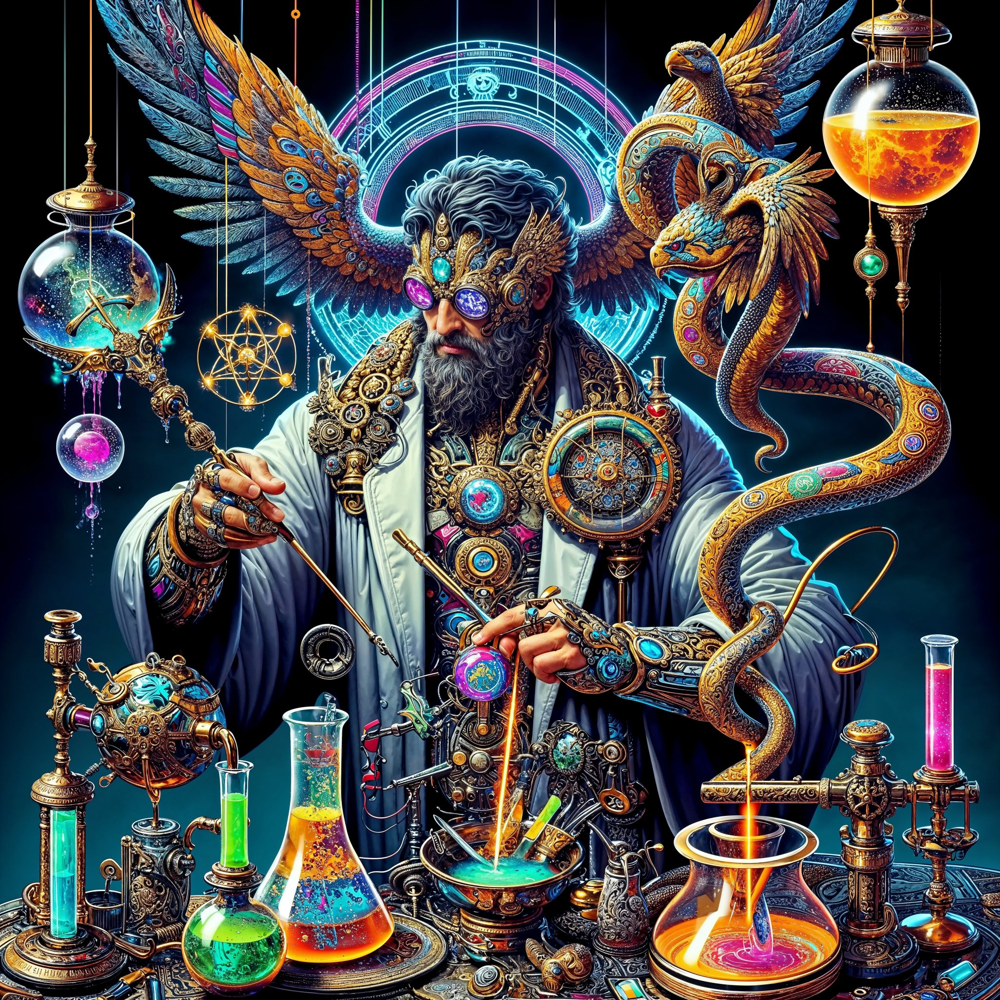

# Nous-Hermes-2-Mixtral-8x7B-DPO Cog model

This is an implementation of the model [NousResearch/Nous-Hermes-2-Mixtral-8x7B-DPO](https://huggingface.co/NousResearch/Nous-Hermes-2-Mixtral-8x7B-DPO) as a Cog model. [Cog packages machine learning models as standard containers.](https://github.com/replicate/cog)

Run predictions:

    cog predict -i prompt="Write a bedtime story about neural networks I can read to my toddler"

